Android Tutorial - Dice Roller App for Mansions of Madness - Part 1 of 5
=======================================
Building a Minimum Viable Product dice roller Android app using the basic Android constructs.

In this tutorial I'm building:
-----------------------------
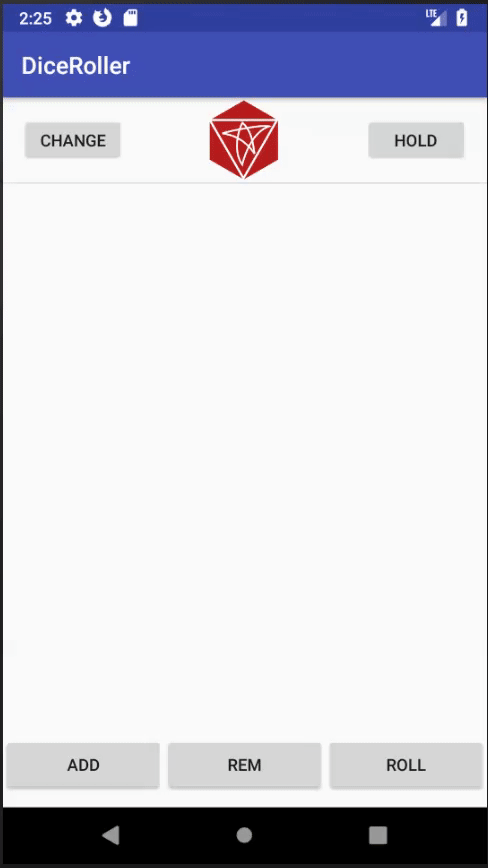

Concepts Covered:
-----------------
* Analysis - Dice Rolling in Mansions of Madness
* Android Studio: Creating An Android Project
* Android Studio: Importing SVG into an Android [````Vector````](https://developer.android.com/guide/topics/graphics/vector-drawable-resources.html)
* Android SDK: Basic Layouts [````RelativeLayout````, ````ConstraintLayout````, ````LinearLayout````]
* Android SDK: Lists with ````ListView```` and  ````ArrayAdapter````

Reader Requirements
------------------------
* Beginner Level Java
* Beginner XML fluency

Table of Contents
-------------------
* [Proposal](#proposal)
    * Idea
    * Mansions of Madness Dice
    * Design
* [Android Studio - Project Setup](#setup)
* [Android Studio - Images, SVG import](#svgimport)
* [Android Design and Layout](#design)
    * App layout : Overall layout for the app.
    * Row layout: layout for each dice row.
* [Lists: Building lists of layouts](#lists)
    * [````ListView````](https://developer.android.com/reference/android/widget/ListView.html) and [````Adapter````](https://developer.android.com/reference/android/widget/ArrayAdapter.html) Logic
    * Add Dice object model representation
* [Buttons: Triggering logic with buttons](#buttons)
    * Add dice
    * Remove dice
    * Hold dice
    * Roll dice

Proposal <a name="proposal"></a>
==========
The Idea
----------------
A little while ago, I got into this board game [Mansions of Madness](https://boardgamegeek.com/boardgame/83330/mansions-madness). The game is a bit like the classic [Clue](https://boardgamegeek.com/boardgame/1294/clue) where players roam around a house trying to solve some mystery. It's an awesome game that I **highly** recommend. Anyway, the game uses dice rolls to resolve actions, and other game events. Oddly, players sometimes have to roll more dice than the game includes (6)! I decided that this was a perfect opportunity to build a custom dice roller app. In this tutorial, I will use basic Android components to build a Mansions of Madness dice roller.

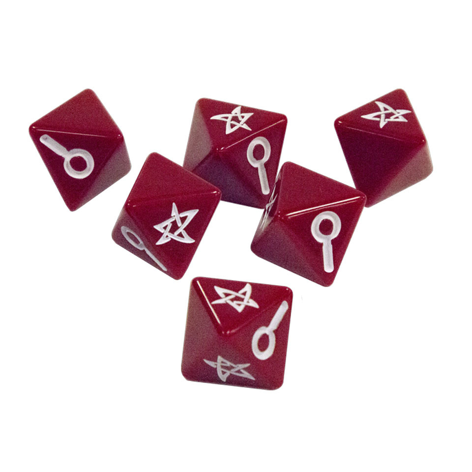

Mansions of Madness Dice
----------------
This dice app is specifically designed for Mansions of Madness gameplay so first I'll outline how the game uses dice.

* **Dice Count**: Players roll between 1 and 10 dice to resolve game events. The number of dice depends on factors like the player's character and the specific event.
* **Probability**: The dice is 8 sided. The odds are:
  * Blank, 3 faces, 37.5%
  * Star, 3 faces, 37.5%
  * Magnifying, 2 faces, 25%
* **Reroll**: Sometimes a player can reroll.
  * **Hold** A player may keep and hold a dice from the previous roll. For example, if a player rolls 3 stars and 1 blank. The player may re-roll that blank.
  * **Change** A player may sometimes change a dice roll from one result to another. For example, if a player  rolls 2 blanks and one magnify. That player may change that magnify result into a star result.

The Design
-------------
To keep things simple, the app will be a vertical, scrollable list of dice. The app will have 3 buttons to trigger functions "Roll Dice", "Add Dice" and "Remove Dice". Each Dice will have a corresponding 'Hold' and 'Change'.


Step 0 : Android Project Setup<a name="setup"></a>
======================
The Android platform is always shifting, making tutorials like these obsolete over time. For reference, my Dev environment:
* Windows 10
* Android Studio V3.1

Android Environment
* Gradle V3.0.1
* Android SDK V3.1
* Minimum Android version 19 (90.1% device coverage)
* Target Android version 27

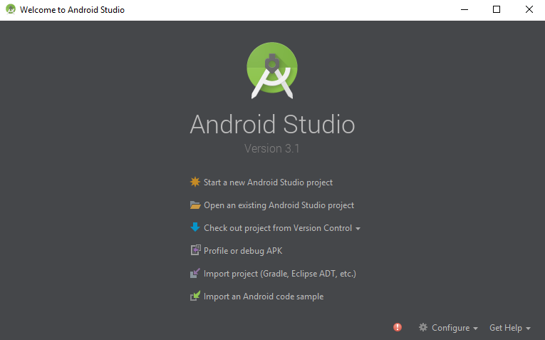

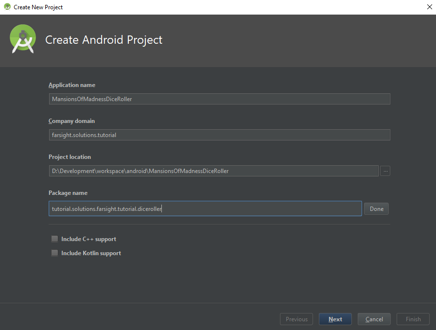

### What is this Application/Package Name for? ###

* **Application name**: Name of the app.
* **Company domain**: This is part of the app's Identity. Android associates the app to the creator to avoid naming conflicts. Imagine 'Stephen' builds an app called "DiceRoller" and 'Joe' builds an app also called "DiceRoller". To deal with this naming collision, Android asks that Stephen and Joe identify their apps with  company domains. This doesn't really come into play too much the app is published into the Playstore.
* **Project location**: Where to put the project in your local file system
* **Package name**: This is the namespace that the app's java classes will use. By default, they line up with the company domain. More about package domains can be found all around the internet including [Java documentation](https://docs.oracle.com/javase/tutorial/java/package/packages.html).

All of these names can be changed *after* project creation though it can get cumbersome to chase all the name references if the project gets complex.

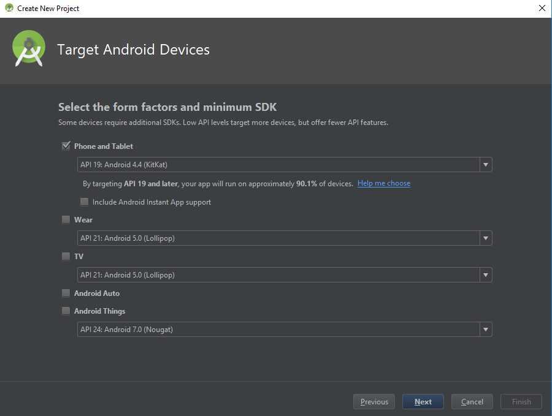

### What is minimum SDK Version? ###

Android has many [versions](https://en.wikipedia.org/wiki/Android_version_history). With each release, the platform changes. This basically means there are lots of Android Devices out in the world with different versions. This becomes a headache for app developers because depending on what libraries the app uses, the app may be incompatible with certain devices. The tradeoff here is that app using the new Android libraries cannot run on older devices. If the app must run on older devices, the app must use some of the older Android constructs.

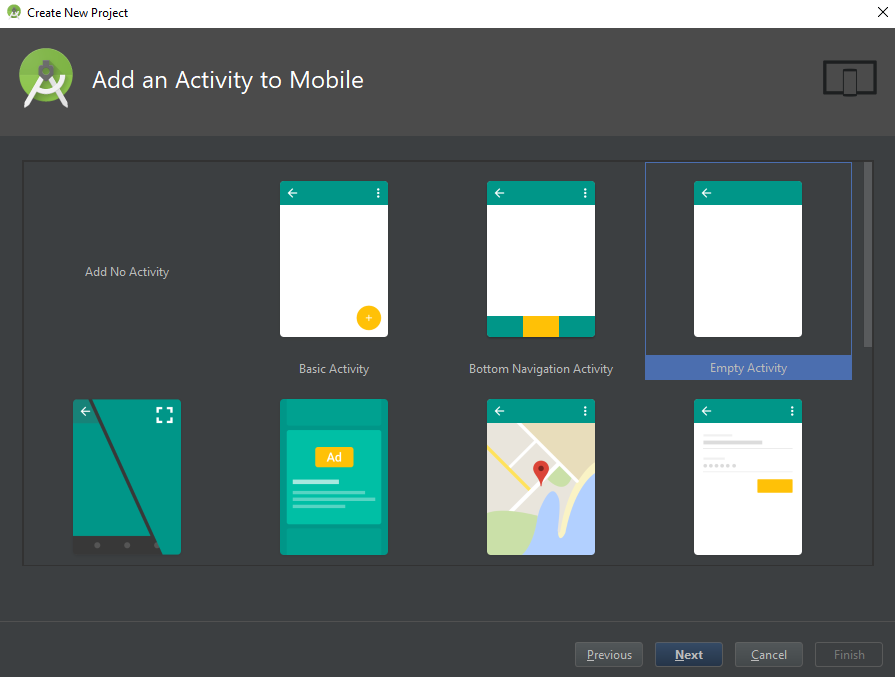

### Why Empty Activity and not Basic Activity? ###

The initial template actually doesn't matter too much for this app. The template code is sometimes useful because it prepopulates the layout and initial classes with some code. Since I'm not going to use any of this, I chose Empty Activity.


### What just happened? What did Android Studio just do? ###

The Android Project creation dialog initializes the project with basic constructs:
1. Android Directory Structure
2. Gradle Build files: Project level and App Level
3. Android Manifest: Application definition
4. MainActivity: Application entry point
5. Initial Layout

### What's Gradle? ###

Gradle is a framework to facilitate building projects. On [Wikipedia](https://en.wikipedia.org/wiki/Gradle)

### What's an Android Manifest? ###

The Android Manifest describe the app to Android. Application properties such as permissions, and Activites. Details can be found on the Android documentation [page](https://developer.android.com/guide/topics/manifest/manifest-intro.html).

Step 1 : Images<a name="svgimport"></a>
===============
To start, I used a simple online SVG editor called [Clker](http://www.clker.com/inc/svgedit/svg-editor.html) to draw out the dice faces as [SVG's](https://en.wikipedia.org/wiki/Scalable_Vector_Graphics).


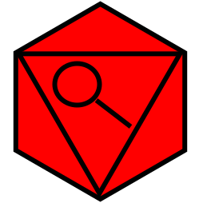

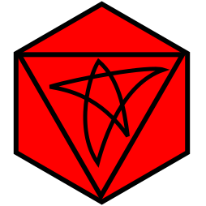

 Next, I import them into my project using Android Studio's Asset Studio.

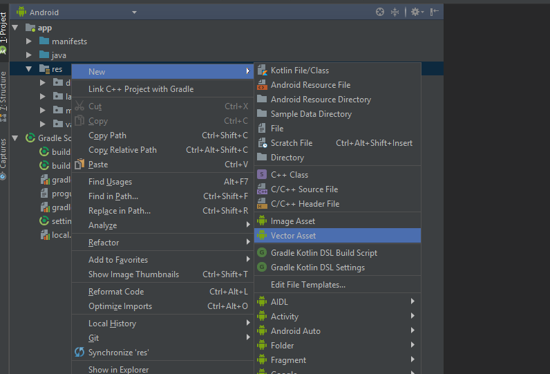

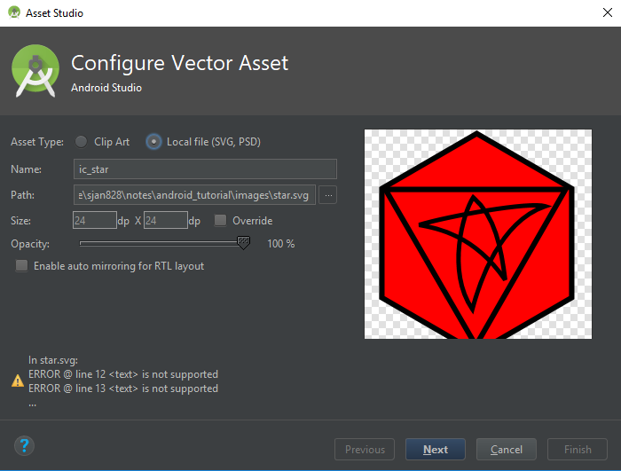

### Why SVG's? ###

Devices have different resolutions and dimensions. Predicting the resolution and dimension of the device the app runs is difficult. Scaling Jpegs can result in blurry or grainy graphics. One way to tackle this is for graphics is to use SVG's. There are numerous articles online discussing SVG's but for reference, please check out the Wikipedia [SVG](https://en.wikipedia.org/wiki/Scalable_Vector_Graphics) article for more information.

Step 2 : Layout<a name="design"></a>
===============

Android offers two ways to describe layouts: programmatic and xml [layouts](https://developer.android.com/guide/topics/ui/declaring-layout.html#write). Describing complex layouts programmaticly is pretty difficult so most people generally avoid that. Writing xml may not be all that fun, but Android Studio does offer several tools to ease the pain. a preview tool and a [WSYWIG](https://en.wikipedia.org/wiki/WYSIWYG) layout editor. But even with the editor, diving into the xml is nearly unavoidable.

## Android Studio Layout Preview tool ##

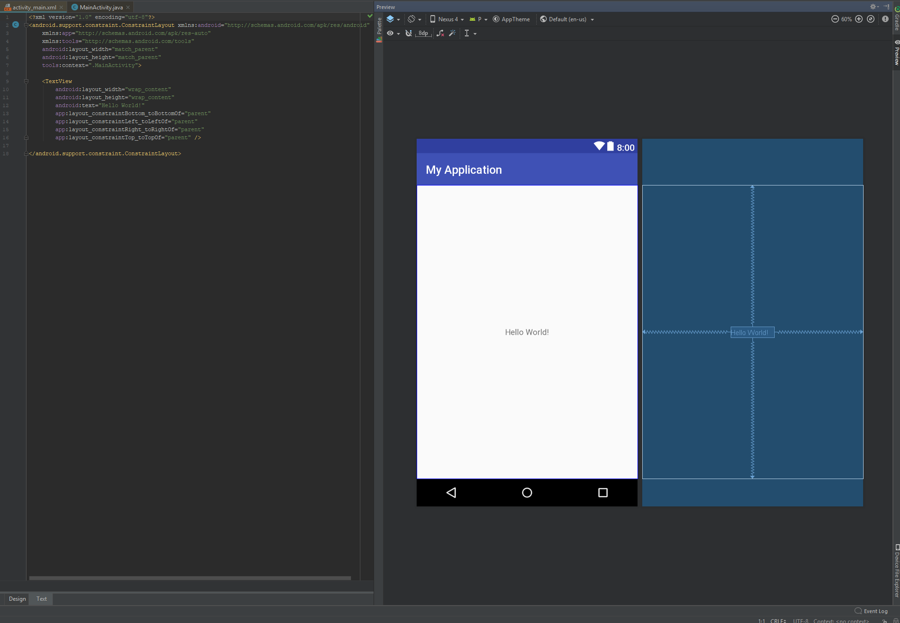

## Android Studio Layout Editor tool ##

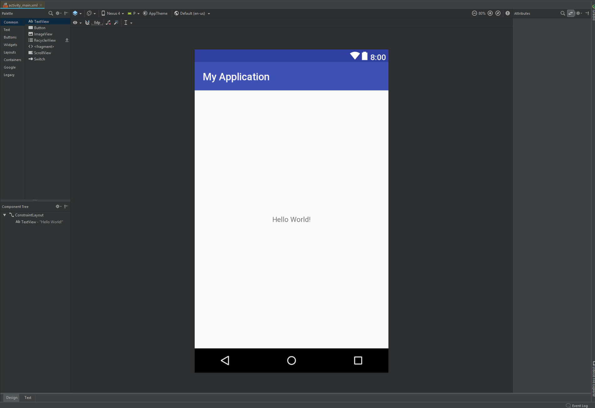

## Dice Application Layout ##

The Android Studio Empty Activity template starts us off with a [````ConstraintLayout````](https://developer.android.com/reference/android/support/constraint/ConstraintLayout.html) root layout element. We'll need two components in this app: Dice area and Controller area. The dice area will be a scrollable dice list and the controller will be the 3 buttons "ADD" "REMOVE" "ROLL".


### ````activity_main.xml```` ###

    <?xml version="1.0" encoding="utf-8"?>
    <android.support.constraint.ConstraintLayout xmlns:android="http://schemas.android.com/apk/res/android"
        xmlns:app="http://schemas.android.com/apk/res-auto"
        xmlns:tools="http://schemas.android.com/tools"
        android:layout_width="match_parent"
        android:layout_height="match_parent"
        tools:context=".MainActivity">

        <ListView
            android:id="@+id/dice_list"
            android:layout_height="0dp"
            android:layout_width="match_parent"
            app:layout_constraintBottom_toTopOf="@id/button_bar"
            app:layout_constraintLeft_toLeftOf="parent"
            app:layout_constraintRight_toRightOf="parent"
            app:layout_constraintTop_toTopOf="parent">
        </ListView>

        <LinearLayout
            android:id="@+id/button_bar"
            android:layout_width="match_parent"
            android:layout_height="@dimen/control_bar_height"
            android:orientation="horizontal"
            android:weightSum="3"
            app:layout_constraintBottom_toBottomOf="parent"
            app:layout_constraintLeft_toLeftOf="parent"
            app:layout_constraintRight_toRightOf="parent"
            app:layout_constraintTop_toBottomOf="@id/dice_list">
            <Button
                android:id="@+id/add_dice_button"
                android:layout_gravity = "center"
                android:layout_weight="1"
                android:layout_width="wrap_content"
                android:layout_height="wrap_content"
                android:text="@string/add_button_label"
                android:onClick="addDice"/>
            <Button
                android:id="@+id/rem_dice_button"
                android:layout_gravity = "center"
                android:layout_weight="1"
                android:layout_width="wrap_content"
                android:layout_height="wrap_content"
                android:text="@string/rem_button_label"
                android:onClick="removeDice"/>
            <Button
                android:id="@+id/roll_dice_button"
                android:layout_weight="1"
                android:layout_gravity = "center"
                android:layout_width="wrap_content"
                android:layout_height="wrap_content"
                android:text="@string/roll_button_label"
                android:onClick="rollDice"/>
        </LinearLayout>

    </android.support.constraint.ConstraintLayout>


For those unfamiliar with xml, the above may look like gibberish. Explaining xml is outside the scope of this tutorial, but Google, YouTube, and Wikipedia are great resources for those looking for more information. For this layout I'm using classes ````ListView````, ````Button````, ````LinearLayout````, and ````ConstraintLayout````. The details around their attributes can be found on the [Android documentation page](https://developer.android.com/index.html).

### Why ConstraintLayout and not LinearLayout or RelativeLayout? ###

I was looking for a ````Layout```` that easily describes a fixed height bottom area(for Buttons) and a top area (for dice) that filled up available screen space. ````LinearLayout```` spaces out its sub elements using weights making it unsuitable. ````RelativeLayout```` does not offer the ability to 'fill remaining space' also making it unsuitable.

### Why ListView and not LinearLayout? ###

Visually, ````LinearLayout```` looks pretty close to what I need. However, ````LinearLayout```` is for static list of elements rather than dynamic lists. For this app, the Dice list can have anywhere between 0 and 25 dice, making ListView is a better candidate.

### Why is ListView's height 0dp? ###

The ````0dp```` value is specific to [````ConstraintLayout````](https://developer.android.com/reference/android/support/constraint/ConstraintLayout.html) that indicates that it should fill the remaining space of the parent.

## Row Layout ##

As described above, each dice row includes 2 buttons and a dice image.


### ````row.xml```` ###

    <?xml version="1.0" encoding="utf-8"?>
    <RelativeLayout
        xmlns:android="http://schemas.android.com/apk/res/android"
        android:layout_width="match_parent"
        android:layout_height="@dimen/row_height">
        <FrameLayout
            android:layout_width="wrap_content"
            android:layout_height="@dimen/row_height"
            android:layout_alignParentStart="true"
            android:layout_centerVertical="true"
            android:padding="@dimen/row_padding">
            <Button
                android:id="@+id/dice_change_button"
                android:layout_width="wrap_content"
                android:layout_height="wrap_content"
                android:text="@string/change_button_label">
            </Button>
        </FrameLayout>

        <ImageView
            android:id="@+id/dice_icon"
            android:layout_centerInParent="true"
            android:layout_width="@dimen/image_width"
            android:layout_height="@dimen/image_height"
            android:src="@drawable/blank_dice"/>
        <FrameLayout
            android:layout_width="wrap_content"
            android:layout_height="@dimen/row_height"
            android:layout_alignParentEnd="true"
            android:layout_centerVertical="true"
            android:padding="@dimen/row_padding">
            <Button
                android:id="@+id/dice_hold_button"
                android:layout_width="wrap_content"
                android:layout_height="wrap_content"
                android:text="@string/hold_button_label">
            </Button>
        </FrameLayout>
    </RelativeLayout>


### Why wrap the Button with FrameLayout? ###

The button sits at the vertical center of the row and some distance from each edge. I felt that the design would be cleaner if the design separated the actual button element and its position in the layout. So for my app, I use the ````FrameLayout```` to specify the position and center the button in that layout.

## String and Dimension values ##

String and Dimension values allow us to not write configuration Strings and Integers directly into code. For our small app, maybe not a big deal.

### ````string.xml```` ###

    <resources>
      <string name="app_name">DiceRoller</string>
      <string name="hold_button_label">Hold</string>
      <string name="change_button_label">Change</string>
      <string name="add_button_label">ADD</string>
      <string name="rem_button_label">REM</string>
      <string name="roll_button_label">ROLL</string>
    </resources>

### ````dimens.xml```` ###

    <?xml version="1.0" encoding="utf-8"?>
    <resources>
      <dimen name="row_height">72dp</dimen>
      <dimen name="row_padding">16dp</dimen>
      <dimen name="control_bar_height">72dp</dimen>
      <dimen name="image_width">72dp</dimen>
      <dimen name="image_height">72dp</dimen>
    </resources>

Step 3 ````ListView```` and ````ArrayAdapter````<a name="lists"></a>
================================================
At this point, I've initialized our Android Project with an Empty MainActivity and mocked out some layouts.  Next, I'll get into the logic and code. To start, I'd like to get into some more Android specific Java classes. [````ListView````](https://developer.android.com/reference/android/widget/ListView.html) is a basic layout class for rendering visual lists. The Android framework separates the visual components (````ListView````) and data components (````List<Dice>````) by employing an [Adapter Pattern](https://en.wikipedia.org/wiki/Adapter_pattern). In our case, all the adapter does is map the data(````Dice````) to some visual layout(````dice_row.xml````). In this case, a layout xml file describes the layout.

### ````MainActivity.java```` ###

    public class MainActivity extends AppCompatActivity {
        DiceAdapter diceAdapter;
        List <Dice> diceList = new ArrayList<>();

        @Override
        protected void onCreate(Bundle savedInstanceState) {
            super.onCreate(savedInstanceState);
            //associating activity to layout
            setContentView(R.layout.activity_main);

            //Setup ListView and Adapter
            ListView listView = findViewById(R.id.dice_list);
            diceAdapter = new DiceAdapter(this, R.layout.dice_row, diceList);
            listView.setAdapter(diceAdapter);

            //Initialize Data
            diceAdapter.add(new Dice());
        }

        public class DiceAdapter extends ArrayAdapter<Dice> {
            public DiceAdapter(@NonNull Context context, int resource, List<Dice> list) {
                super(context, resource, list);
            }

            @Override
            public View getView(final int position, View convertView, ViewGroup parent) {
                if (convertView == null) {
                    convertView = LayoutInflater.from(getContext()).inflate(R.layout.dice_row, parent, false);
                }

                return convertView;
            }
        }
    }


## Dice Object

The app will represent the dice state with Dice Objects. The Dice object has two properties things: dice value [Blank, Magnify, Star], and whether the dice is 'held'. Functionally, the Dice has a roll method that will randomly select a dice face. Finally, I add a method that changes the dice value to the next on the list.


### ````MainActivity.java```` ###

    ....
    public static class Dice {
      public enum Face {
          BLANK,
          MAGNIFY,
          STAR
      }

      public static Random random = new Random();

      boolean hold = false;
      Face diceVal;

      Dice() {
          roll();
      }

      public void roll() {
          int num = random.nextInt(4);
          if(num == 0) { //25% magify
              this.diceVal = Face.MAGNIFY;
          } else {
              //37.5% star, 37.5% blank
              if(random.nextBoolean()) {
                  this.diceVal = Face.BLANK;
              } else {
                  this.diceVal = Face.STAR;
              }
          }
      }

      public void toggleHold() {
          hold = !hold;
      }

      public void nextValue() {
          int index = diceVal.ordinal();
          index = (index+1) % Face.values().length;
          diceVal = Face.values()[index];
      }
    }

Step 4 Buttons<a name="buttons"></a>
=====================

In this step I map button clicks to logic. The Android platform offers a couple ways to do this. One way is to specify an attribute from the layout file. Another is to programmatically set the ````onClickListener````. In our app, use attribute approach for the three top level buttons and programmatically set the listener for the row buttons.

Add Button
-------------
````addDice```` if dice count is less than 25, adds a new Dice object to the Dice list.

Design

### ````activity_main.xml```` ###

    ....
    <Button
      android:id="@+id/add_dice_button"
      android:layout_gravity = "center"
      android:layout_weight="1"
      android:layout_width="wrap_content"
      android:layout_height="wrap_content"
      android:text="@string/add_button_label"
      android:onClick="addDice"/>
    ....

Logic

### ````MainActivity.java```` ###

    ....
    public void addDice(View view) {
       if(diceList.size()< MAX_DICE_COUNT) {
           diceAdapter.add(new Dice());
       }
    }
    ....

Remove Button
----------
````removeDice```` if Dice list is not empty, removes the last dice from the list

Design

### ````activity_main.xml```` ###

    ....
    <Button
       android:id="@+id/rem_dice_button"
       android:layout_gravity = "center"
       android:layout_weight="1"
       android:layout_width="wrap_content"
       android:layout_height="wrap_content"
       android:text="@string/rem_button_label"
       android:onClick="removeDice"/>
    ....

Logic

### ````MainActivity.java```` ###

    ....
    public void removeDice(View view) {
          if(!diceList.isEmpty()) {
            int lastIndex = diceList.size() - 1;
            diceAdapter.remove(diceAdapter.getItem(lastIndex));
          }
       }
    ....

Roll Button
----------
````rollDice```` Rerolls the value of every dice on he list that hasn't been marked for holding.

Design

### ````activity_main.xml```` ###
    ....
    <Button
        android:id="@+id/roll_dice_button"
        android:layout_weight="1"
        android:layout_gravity = "center"
        android:layout_width="wrap_content"
        android:layout_height="wrap_content"
        android:text="@string/roll_button_label"
        android:onClick="rollDice"/>
    ....

Logic

### ````MainActivity.java```` ###
    ....
    public void rollDice(View view) {
        //roll all dice
        for(Dice dice : diceList) {
            if(!dice.hold)
                dice.roll();
        }

        //notify adapter to update view
        diceAdapter.notifyDataSetChanged();
    }
    ....

### What's ````notifyDataSetChanged````? ###

The roll button changes the diceValue for the corresponding Dice object. Due to View/Data Adapter Pattern separation, the Dice row layout does not automatically re-render unless triggered. Calling  ````notifyDataSetChanged```` redraws the view.

Hold Button
----
Clicking hold button will set the dice's hold flag.

### ````MainActivity.java```` ###
    ....
    Button holdButton = convertView.findViewById(R.id.dice_hold_button);
    holdButton.setOnClickListener(new View.OnClickListener() {
        @Override
        public void onClick(View v) {
            Dice dice = diceList.get(position);
            dice.toggleHold();
        }
    });
    ....

Change Button
----
Clicking hold button will change the dice's value and update interface.

### ````MainActivity.java```` ###
    ....
    Button changeButton = convertView.findViewById(R.id.dice_change_button);
    changeButton.setOnClickListener(new View.OnClickListener() {
        @Override
        public void onClick(View v) {
            Dice dice = diceList.get(position);
            dice.nextValue();
            diceAdapter.notifyDataSetChanged();
        }
    });
    ....
