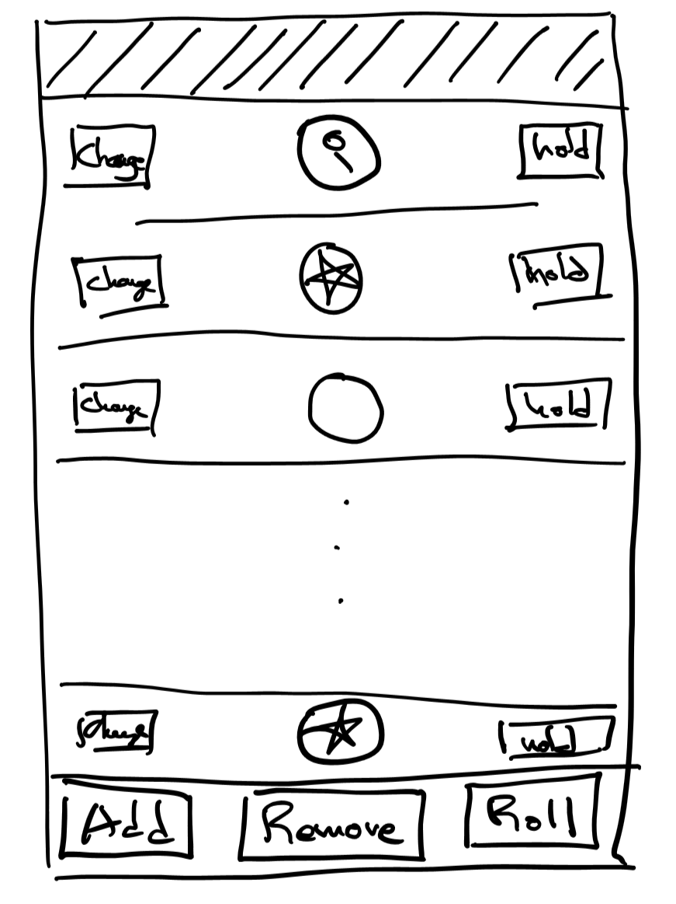
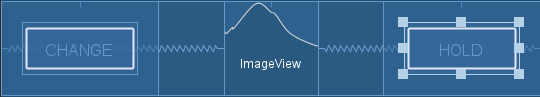
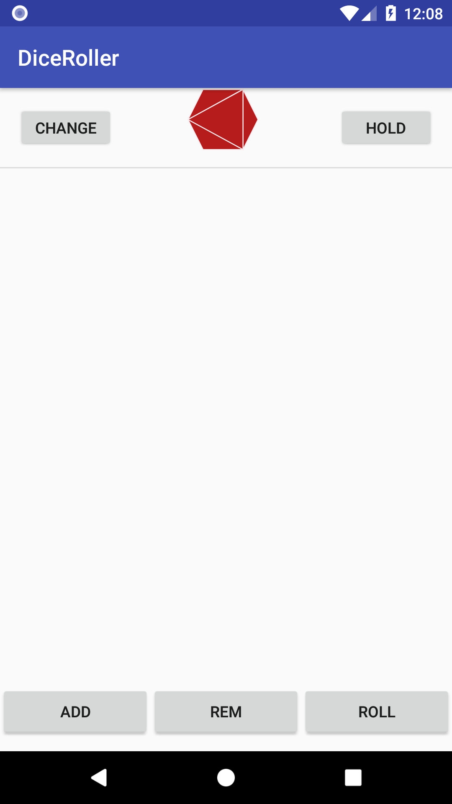
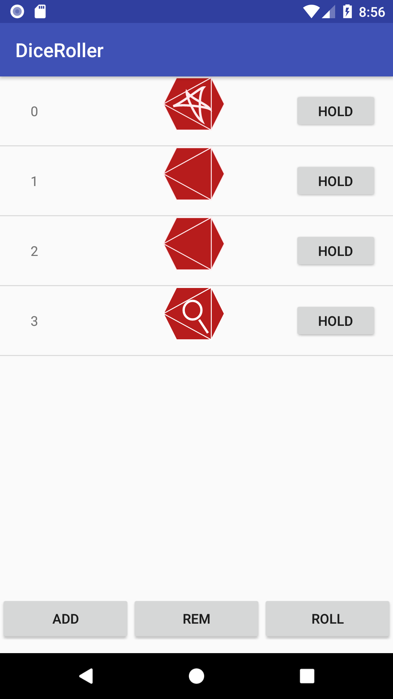

Android App - Mansions of Madness Dice Roller - Part1
=======================================
A little while ago, I got into a board game called [Mansions of Madness](https://boardgamegeek.com/boardgame/83330/mansions-madness). The game is a bit like the classic [Clue](https://boardgamegeek.com/boardgame/1294/clue) where players roam around a house trying to solve some mystery. Its an awesome game and I **highly** recommend it. Anyway, the game uses dice rolls to resolve things like moves, events, and combat. Oddly, players are sometimes asked to roll more dice than the game includes (6). I decided that this was a perfect opportunity to build an dice roller app! In this tutorial, we will use basic Android components to build a Mansions of Madness dice roller.


Requirements
=============
This dice app is specifically designed for Mansions of Madness gameplay.

* Custom 8 Sided Dice Mansions of Madness dice have three 3 face types.
  * Magnifying glass, 2 faces
  * Blank, 3 faces
  * Pagan Star, 3 faces
* **Roll Dice**: Players roll an 8 sided dice. The odds are: 37.5% Blank, 25% Magnifying, 37.5% Star.
* **Add/Remove Dice**
  * A player can add or remove dice from a roll.
  * 25 is the max dice count.
* **Reroll**: Sometimes a player can reroll.
  * During a rerolls, a player may keep and hold a dice from the previous roll. For our app, we will include a "HOLD" Button.
  * Sometimes, a player gets the ability to change a dice roll from one result to another. For example, a player can change a magnifying glass into a star.

Design
=======
To keep things simple, the app will be a vertical list of dice. Other than the dice list, we need buttons to trigger functions like "Roll Dice", "Add Dice" and "Remove Dice".



Implementation Steps
======================
0. Setup Project
1. Images: Dice faces [Magnifying Glass, Star, Blank]
2. Design and Layout
    * Container layout : Overall layout for the app.
    * Row layout: layout for each dice row.
3. Implement Dice list
    * ListView and Adapter Logic: the logic backing the [ListView](https://developer.android.com/reference/android/widget/ListView.html)
    * Add Dice object representation
4. Implement Buttons
    * Add dice
    * Remove dice
    * Hold dice
    * Roll dice

Step 0 : Setup Project
======================
The Android platform is always shifting, making tutorials like these obsolete over time. My April 2018 dev environment:

* Windows 10
* Android Studio V3.1
* Gradle V3.0.1
* Android SDK V3.1
* Empty Activity Template

For this app, i'm targetting Android version 27 with a minimum sdk version of 17.

Step 1 : Images
===============
To start, I used a simple [SVG editor]() to draw out the dice faces as [SVG's](https://en.wikipedia.org/wiki/Scalable_Vector_Graphics). Then I import them into VectorDrawables using Android Studio's Asset Studio.


Step 2 : Design and Layout
================

The Android Studio Empty Activity template starts us off with a [````ConstraintLayout````](https://developer.android.com/reference/android/support/constraint/ConstraintLayout.html) root layout element. We'll need two components in this app: Dice area and Controller area. The dice area will be a scrollable dice list and the controller will be the 3 buttons "ADD" "REMOVE" "ROLL".


    <?xml version="1.0" encoding="utf-8"?>
    <android.support.constraint.ConstraintLayout xmlns:android="http://schemas.android.com/apk/res/android"
        xmlns:app="http://schemas.android.com/apk/res-auto"
        xmlns:tools="http://schemas.android.com/tools"
        android:layout_width="match_parent"
        android:layout_height="match_parent"
        tools:context=".MainActivity">

        <ListView
            android:id="@+id/dice_list"
            android:layout_height="0dp"
            android:layout_width="match_parent"
            app:layout_constraintBottom_toTopOf="@id/button_bar"
            app:layout_constraintLeft_toLeftOf="parent"
            app:layout_constraintRight_toRightOf="parent"
            app:layout_constraintTop_toTopOf="parent">
        </ListView>

        <LinearLayout
            android:id="@+id/button_bar"
            android:layout_width="match_parent"
            android:layout_height="@dimen/control_bar_height"
            android:orientation="horizontal"
            android:weightSum="3"
            app:layout_constraintBottom_toBottomOf="parent"
            app:layout_constraintLeft_toLeftOf="parent"
            app:layout_constraintRight_toRightOf="parent"
            app:layout_constraintTop_toBottomOf="@id/dice_list">
            <Button
                android:id="@+id/add_dice_button"
                android:layout_gravity = "center"
                android:layout_weight="1"
                android:layout_width="wrap_content"
                android:layout_height="wrap_content"
                android:text="@string/add_button_label"
                android:onClick="addDice"/>
            <Button
                android:id="@+id/rem_dice_button"
                android:layout_gravity = "center"
                android:layout_weight="1"
                android:layout_width="wrap_content"
                android:layout_height="wrap_content"
                android:text="@string/rem_button_label"
                android:onClick="removeDice"/>
            <Button
                android:id="@+id/roll_dice_button"
                android:layout_weight="1"
                android:layout_gravity = "center"
                android:layout_width="wrap_content"
                android:layout_height="wrap_content"
                android:text="@string/roll_button_label"
                android:onClick="rollDice"/>
        </LinearLayout>

    </android.support.constraint.ConstraintLayout>


For those unfamiliar with xml, the above may look like gibberish. Explaining xml is outside the scope of this tutorial, but Google, YouTube, and Wikipedia are great resources for those looking for more information. For those fluent in XML, you might be wondering about the class references and attributes. For this layout I'm using classes ````ListView````, ````Button````, ````LinearLayout````, and ````ConstraintLayout````. The details around what they are and their attributes can be found on the [Android documentation page](https://developer.android.com/index.html).

### Why ConstraintLayout and not LinearLayout or RelativeLayout? ###

I was looking for a ````Layout```` that easily describes a fixed height bottom area(for Buttons) and a top area (for dice) that filled up available screen space. ````LinearLayout```` spaces out its sub elements using weights making it unsuitable. ````RelativeLayout```` does not offer the ability to 'fill remaining space' also making it unsuitable.

### Why ListView and not LinearLayout? ###

Visually, ````LinearLayout```` looks pretty close to what we need. However, ````LinearLayout```` is for static list of elements rather than dynamic lists. For this app, the Dice list can have anywhere between 0 and 25 dice, making ListView is a better candidate.

### Why is ListView's height 0dp? ###

The ````0dp```` value is specific to [````ConstraintLayout````](https://developer.android.com/reference/android/support/constraint/ConstraintLayout.html) that indicates that it should fill the remaining space of the parent.

Row Layout
=======================
As described above, each dice row includes 2 buttons and a dice image.



    <?xml version="1.0" encoding="utf-8"?>
    <RelativeLayout
        xmlns:android="http://schemas.android.com/apk/res/android"
        android:layout_width="match_parent"
        android:layout_height="@dimen/row_height">
        <FrameLayout
            android:layout_width="wrap_content"
            android:layout_height="@dimen/row_height"
            android:layout_alignParentStart="true"
            android:layout_centerVertical="true"
            android:padding="@dimen/row_padding">
            <Button
                android:id="@+id/dice_change_button"
                android:layout_width="wrap_content"
                android:layout_height="wrap_content"
                android:text="@string/change_button_label">
            </Button>
        </FrameLayout>

        <ImageView
            android:id="@+id/dice_icon"
            android:layout_centerInParent="true"
            android:layout_width="@dimen/image_width"
            android:layout_height="@dimen/image_height"
            android:src="@drawable/blank_dice"/>
        <FrameLayout
            android:layout_width="wrap_content"
            android:layout_height="@dimen/row_height"
            android:layout_alignParentEnd="true"
            android:layout_centerVertical="true"
            android:padding="@dimen/row_padding">
            <Button
                android:id="@+id/dice_hold_button"
                android:layout_width="wrap_content"
                android:layout_height="wrap_content"
                android:text="@string/hold_button_label">
            </Button>
        </FrameLayout>
    </RelativeLayout>


### Why wrap the Button with FrameLayout? ###

The button sits at the vertical center of the row and some distance from each edge. I felt that the design would be cleaner if the design separated the actual button element and its position in the layout. So for my app, i use the ````FrameLayout```` to specify the position and center the button in that layout.

String and Dimension values
======================

String and Dimension values allow us to not write configuration Strings and Integers directly into code. For our small app, maybe not a big deal.

string.xml

    <resources>
      <string name="app_name">DiceRoller</string>
      <string name="hold_button_label">Hold</string>
      <string name="change_button_label">Change</string>
      <string name="add_button_label">ADD</string>
      <string name="rem_button_label">REM</string>
      <string name="roll_button_label">ROLL</string>
    </resources>

dimens.xml

    <?xml version="1.0" encoding="utf-8"?>
    <resources>
      <dimen name="row_height">72dp</dimen>
      <dimen name="row_padding">16dp</dimen>
      <dimen name="control_bar_height">72dp</dimen>
      <dimen name="image_width">72dp</dimen>
      <dimen name="image_height">72dp</dimen>
    </resources>

Step 3 ListView and Adapter
==============================
At this point, we've initialized our Android Project with an Empty MainActivity and mocked out some layouts.  Next, we'll get into the logic and code. To start, I'd like to get into some more Android specific Java classes. [````ListView````](https://developer.android.com/reference/android/widget/ListView.html) is a basic layout class for rendering visual lists. The Android framework separates the visual components (````ListView````) and data components (````List<Dice>````) by employing an [Adapter Pattern](https://en.wikipedia.org/wiki/Adapter_pattern). In our case, all the adapter does is map the data(````Dice````) to some visual layout(````dice_row.xml````). In this case, a layout xml file describes the layout.

    public class MainActivity extends AppCompatActivity {
        DiceAdapter diceAdapter;
        List <Dice> diceList = new ArrayList<>();

        @Override
        protected void onCreate(Bundle savedInstanceState) {
            super.onCreate(savedInstanceState);
            //associating activity to layout
            setContentView(R.layout.activity_main);

            //Setup ListView and Adapter
            ListView listView = findViewById(R.id.dice_list);
            diceAdapter = new DiceAdapter(this, R.layout.dice_row, diceList);
            listView.setAdapter(diceAdapter);

            //Initialize Data
            diceAdapter.add(new Dice());
        }

        public class DiceAdapter extends ArrayAdapter<Dice> {
            public DiceAdapter(@NonNull Context context, int resource, List<Dice> list) {
                super(context, resource, list);
            }

            @Override
            public View getView(final int position, View convertView, ViewGroup parent) {
                if (convertView == null) {
                    convertView = LayoutInflater.from(getContext()).inflate(R.layout.dice_row, parent, false);
                }

                return convertView;
            }
        }
    }


Step 3 Dice Object
==================
The app will represent the dice state with Dice Objects. The Dice object has two properties things: dice value [Blank, Magnify, Star], and whether the dice is 'held'. Functionally, the Dice has a roll method that will randomly select a dice face. Finally, we add a method that changes the dice value to the next on the list.

    MainActivity.java
    ....
    public static class Dice {
      public enum Face {
          BLANK,
          MAGNIFY,
          STAR
      }

      public static Random random = new Random();

      boolean hold = false;
      Face diceVal;

      Dice() {
          roll();
      }

      public void roll() {
          int num = random.nextInt(4);
          if(num == 0) { //25% magify
              this.diceVal = Face.MAGNIFY;
          } else {
              //37.5% star, 37.5% blank
              if(random.nextBoolean()) {
                  this.diceVal = Face.BLANK;
              } else {
                  this.diceVal = Face.STAR;
              }
          }
      }

      public void toggleHold() {
          hold = !hold;
      }

      public void nextValue() {
          int index = diceVal.ordinal();
          index = (index+1) % Face.values().length;
          diceVal = Face.values()[index];
      }
  }

Screenshot



Step 4 Buttons
=====================

In this step we map button clicks to logic. The Android platform offers a couple ways to do this. One way is to specify an attribute from the layout file. Another is to programmatically set the ````onClickListener````. In our app, use attribute approach for the three top level buttons and programmatically set the listener for the row buttons.

Add Button
-------------
````addDice```` if dice count is less than 25, adds a new Dice object to the Dice list.

Design

    main_activity.xml
    ....
    <Button
      android:id="@+id/add_dice_button"
      android:layout_gravity = "center"
      android:layout_weight="1"
      android:layout_width="wrap_content"
      android:layout_height="wrap_content"
      android:text="@string/add_button_label"
      android:onClick="addDice"/>
    ....

Logic

    MainActivity.java
    ....
    public void addDice(View view) {
       if(diceList.size()< MAX_DICE_COUNT) {
           diceAdapter.add(new Dice());
       }
   }
    ....

Remove Button
----------
````removeDice```` if Dice list is not empty, removes the last dice from the list

Design

    main_activity.xml
    ....
    <Button
       android:id="@+id/rem_dice_button"
       android:layout_gravity = "center"
       android:layout_weight="1"
       android:layout_width="wrap_content"
       android:layout_height="wrap_content"
       android:text="@string/rem_button_label"
       android:onClick="removeDice"/>
    ....

Logic

    MainActivity.java
    ....
    public void removeDice(View view) {
          if(!diceList.isEmpty()) {
            int lastIndex = diceList.size() - 1;
            diceAdapter.remove(diceAdapter.getItem(lastIndex));
          }
       }
    ....

Roll Button
----------
````rollDice```` Rerolls the value of every dice on he list that hasn't been marked for holding.

Design

    activity_main.xml
    ....
    <Button
        android:id="@+id/roll_dice_button"
        android:layout_weight="1"
        android:layout_gravity = "center"
        android:layout_width="wrap_content"
        android:layout_height="wrap_content"
        android:text="@string/roll_button_label"
        android:onClick="rollDice"/>
    ....

Logic

    MainActivity
    ....
    public void rollDice(View view) {
        //roll all dice
        for(Dice dice : diceList) {
            if(!dice.hold)
                dice.roll();
        }

        //notify adapter to update view
        diceAdapter.notifyDataSetChanged();
    }
    ....

### What's ````notifyDataSetChanged````? ###

The roll button changes the diceValue for the corresponding Dice object. Due to View/Data Adapter Pattern separation, the Dice row layout does not automatically re-render unless triggered. Calling  ````notifyDataSetChanged```` redraws the view.

Hold Button
----
Set the dice's hold flag

    MainActivity
    ....
    Button holdButton = convertView.findViewById(R.id.dice_hold_button);
    holdButton.setOnClickListener(new View.OnClickListener() {
        @Override
        public void onClick(View v) {
            Dice dice = diceList.get(position);
            dice.toggleHold();
        }
    });
    ....

Change Button
----
Change the diceValue to next.

    MainActivity
    ....
    Button changeButton = convertView.findViewById(R.id.dice_change_button);
    changeButton.setOnClickListener(new View.OnClickListener() {
        @Override
        public void onClick(View v) {
            Dice dice = diceList.get(position);
            dice.nextValue();
            diceAdapter.notifyDataSetChanged();
        }
    });
    ....


